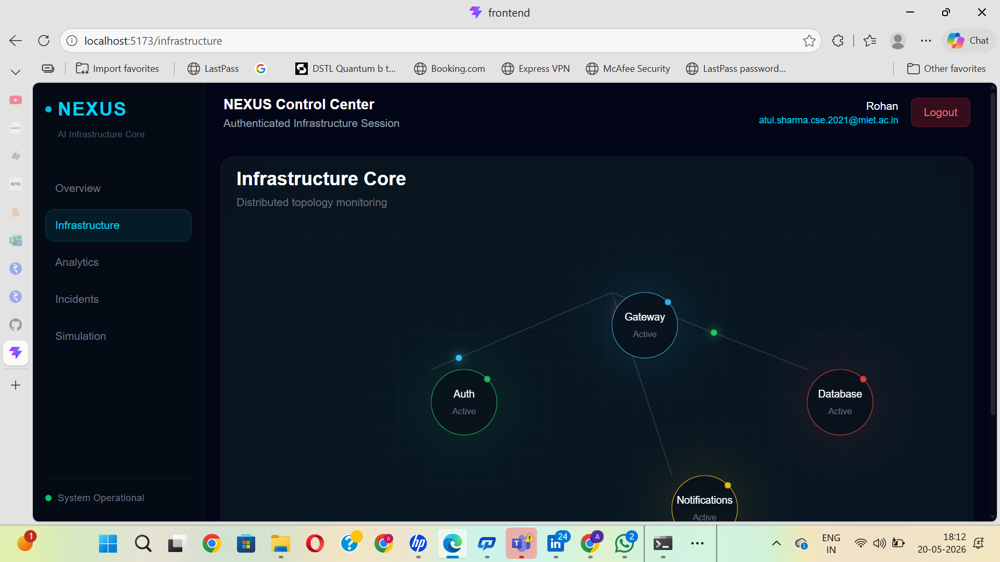
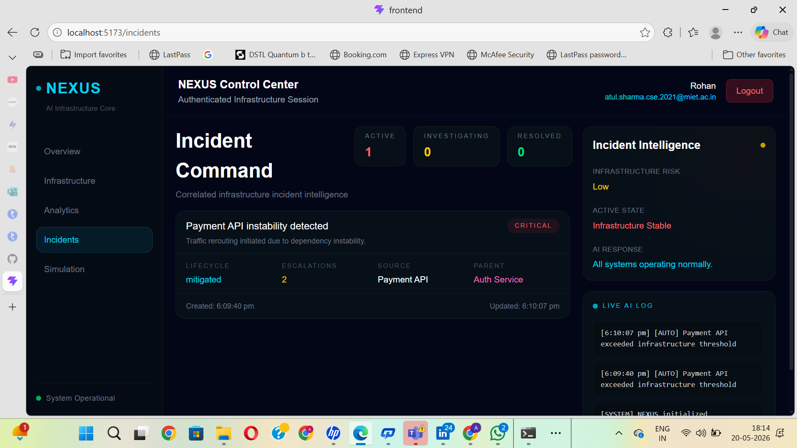
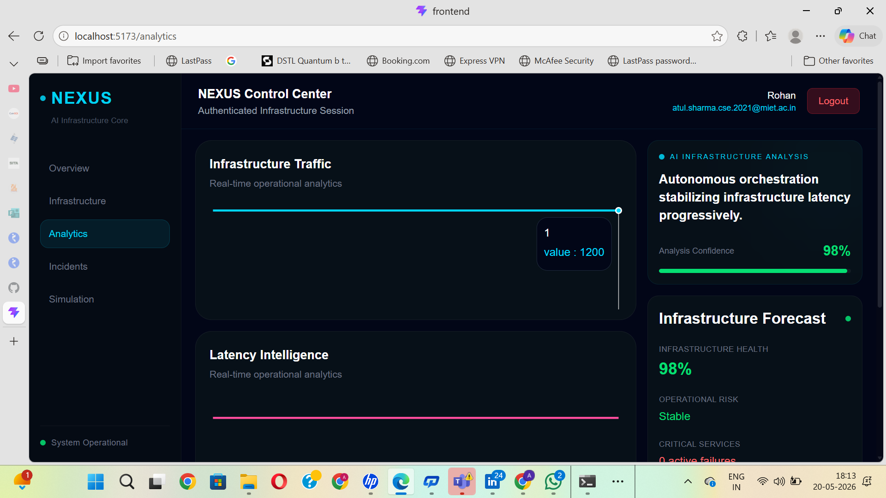
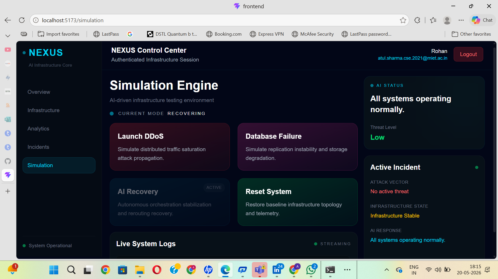
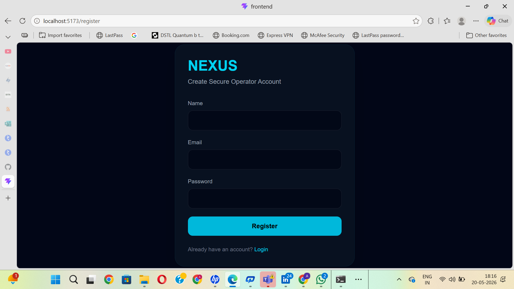

# Autonomous Infrastructure Orchestration System

Advanced AI-driven infrastructure monitoring platform featuring real-time telemetry, autonomous orchestration, intelligent incident response, and live infrastructure visualization.

---

## Overview

Autonomous Infrastructure Orchestration System is a modern full-stack infrastructure intelligence platform designed to simulate how next-generation AI systems monitor, analyze, and stabilize distributed services in real time.

The platform includes:

- Real-time service monitoring
- AI-driven incident orchestration
- Infrastructure topology visualization
- Live analytics dashboard
- Autonomous threat response simulation
- Intelligent incident tracking
- Interactive AI core visualization
- Authentication system
- Backend + frontend architecture

---

## Features

### AI Infrastructure Dashboard
- Live telemetry metrics
- Autonomous infrastructure entity
- Real-time traffic and latency monitoring
- Animated AI orchestration core

### Infrastructure Monitoring
- Service dependency graph
- Infrastructure topology visualization
- Live node status monitoring
- Critical service detection

### Incident Command Center
- AI-generated incident analysis
- Infrastructure risk evaluation
- Autonomous response logs
- Incident lifecycle management

### Analytics System
- Real-time infrastructure analytics
- Traffic visualization
- Service health tracking
- Performance monitoring

### Simulation Engine
- Autonomous threat simulation
- Infrastructure instability testing
- Recovery orchestration simulation

### Authentication
- Login/Register system
- Protected infrastructure session flow

---

## Tech Stack

### Frontend
- React.js
- Vite
- Tailwind CSS
- Framer Motion
- Recharts

### Backend
- Node.js
- Express.js
- Socket.IO

---

## Project Structure

```bash
Autonomous-Infrastructure-Orchestration-System
│
├── frontend
│   ├── public
│   │   └── screenshots
│   ├── src
│   │   ├── ai
│   │   ├── components
│   │   ├── context
│   │   ├── pages
│   │   ├── services
│   │   └── widgets
│   │
│   └── package.json
│
├── backend
│   ├── src
│   └── package.json
│
└── README.md
```

---

## Screenshots

### Dashboard
.png)

### Infrastructure


### Incidents


### Analytics


### Simulation


### Authentication


---

## Installation

Clone the repository:

```bash
git clone https://github.com/atulsharma47/Autonomous-Infrastructure-Orchestration-System.git
```

Move into project directory:

```bash
cd Autonomous-Infrastructure-Orchestration-System
```

---

## Frontend Setup

```bash
cd frontend
npm install
npm run dev
```

Frontend runs on:

```bash
http://localhost:5173
```

---

## Backend Setup

Open another terminal:

```bash
cd backend
npm install
npm start
```

Backend runs on:

```bash
http://localhost:5000
```

---

## Current Intelligence Capabilities

- Autonomous service health evaluation
- Infrastructure risk calculation
- Live telemetry synchronization
- AI incident reasoning
- Service dependency tracking
- Threat state orchestration
- Infrastructure stabilization simulation

---

## Future Enhancements

- Real AI anomaly detection
- Machine learning threat prediction
- Kubernetes infrastructure integration
- Docker deployment pipeline
- Voice-controlled infrastructure orchestration
- AI-generated infrastructure recovery plans
- WebSocket distributed telemetry streaming
- Cloud deployment architecture
- Role-based authentication
- Persistent database integration

---

## Security Notes

The repository ignores:

- `.env`
- `node_modules`
- build/dist files
- local configuration files

Sensitive environment variables are never committed.

---

## Author

### Atul Sharma

Backend-focused developer building scalable systems, AI-driven infrastructure platforms, and real-time orchestration applications.

GitHub:
https://github.com/atulsharma47

LinkedIn:
https://www.linkedin.com/in/atul-sharma-ab03882b6/

---

## License

This project is currently intended for educational, portfolio, and research purposes.
